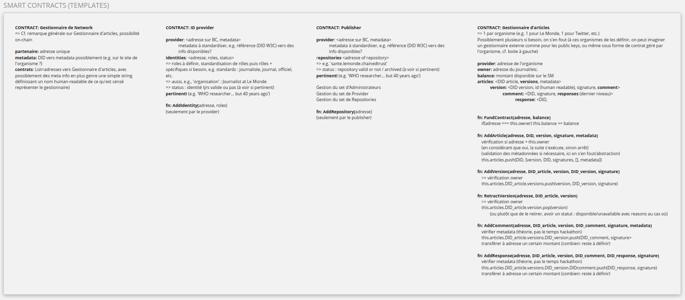

# News For Trust


NewsForTrust aims to provide a platform for certifying and incentivize experts' contributions and comments on publishing platforms valuing high-quality dialogue.

Publishers joining the network are able to build expertise-defined collections of articles and allow for contributors to participate new information to them.
Whether these are from parties externally validated as experts in the field, or simply from readers voicing their takes with or without source, contributions and comments are keyed in with their writer' persona ID, and rewarded depending on a publisher-defined scheme.


Contracts are built on the NEAR Platform and allow:
- ChainedTrust to integrate new actors, Publishers and ID providers
- ID Providers to validate the real identity of an actor, linking their key to data representing their expertise field and level
- ID Providers to validate the real identity of an actor, linking their key to data representing their expertise field and level
- Collections to manage their sets of articles and corresponding comments, and value and reward contributions


## For NEAR, IPFS & FILECOIN codebases
  
For the Server managing Near contracts, it is hosted here: https://github.com/Ornythoma/NewsForTrust/tree/master/NEAR/Server
Especially, the controllers (main logic) are there: https://github.com/Ornythoma/NewsForTrust/tree/master/NEAR/Server/src/controllers
With the appropriate configuration here: https://github.com/Ornythoma/NewsForTrust/blob/master/NEAR/Server/config/development.js

For the CLI tool to manage the whole logic (submission of articles and comments to Filecoin (content) and NEAR (metadata)), we use this repository: https://github.com/Ornythoma/NewsForTrust/tree/master/CLI
Especially, the logic related to the CLI is hosted in this file: https://github.com/Ornythoma/NewsForTrust/blob/master/CLI/src/controllers/cli.ts

=> DEVELOPMENT in TypeScript, Express.JS for REST API, configuration (cf. configuration files + environment variables defined for that), clear modularization (main entry point, controllers, ExpressJS server (including router and related routes), helpers, etc.)


## Stakeholder + Needs

[](https://miro.com/app/board/o9J_lmoK-P0=/?moveToWidget=3074457366713903718&cot=14)

  

## Why NEAR?

- Multichain support, which enables a whole ecosystem where identity providers and publishers may interact while being on different chains
- Design scalable-friendly and enforcement of low fees for transactions and contract calls, which is really important in this context, as articles, comments and responses are expected to be published regularly and in a consequent way
- Support for account names, which facilitates the identification of the actors of the ChainedTrust ecosystem easily, abstracting intrinsic complexity of traditional blockchain where users have to use private/public keys and long addresses
- Support of AssemblyScript in addition to Rust, which eases the integration within web applications where articles, comments and responses are expected to be submitted and verified

  

## Contracts?

[](https://miro.com/app/board/o9J_lmoK-P0=/?moveToWidget=3074457366715072995&cot=14)

  

## ISSUES / FUTURE

[](https://miro.com/app/board/o9J_lmoK-P0=/?moveToWidget=3074457366714984311&cot=14)

  

## How To

  

_See ChainedTrust Script_

  

<details>

<summary>Expand for deployment instructions.</summary>

```

>>> Identity providers

** Deployment of Identity provider contract:

> clear && asb main.ts && near dev-deploy

Contract: dev-1635671797023-51491238395366

  

>>> Network

** Deployment of Network contract:

> clear && asb main.ts && near dev-deploy

Contract: dev-1635656116581-61306509694513

** Initialization of the contract:

> near call dev-1635656116581-61306509694513 Initialize '' --account-id sbhack2021.testnet

** Registration of the created Identity provider

> near call dev-1635656116581-61306509694513 AddProvider '{ "identifier": "Organisation suisse des journalistes", "contract": "dev-1635671797023-51491238395366" }' --account-id sbhack2021.testnet

  
  

>>> Publishers

(Facultative, ignored here)

** Deployment of Publisher contract:

> clear && asb main.ts && near dev-deploy

Contract: N/A

  
  

>>> Repositories

** Deployment of Repository contract:

> clear && asb main.ts && near dev-deploy

Contract: dev-1635670770533-92997932914997

** Initialization of the contract (reference to the global network):

> near call dev-1635670770533-92997932914997 Initialize '{ "network": "dev-1635656116581-61306509694513" }' --account-id sbhack2021.testnet

** Registration of a recognized author who may submit new articles:

> near call dev-1635670770533-92997932914997 AddAuthor '{ "author": "sbhack2021.testnet" }' --account-id sbhack2021.testnet

** Computation of the fingerprint of the article:

> sha256sum /home/vm/article.json

cb6814c74372a8a548e2f0de6ba2114bfe7fdd2a39488a5639c97afac1aca1c7

** Registration of a new article as an authorized author:

> near call dev-1635670770533-92997932914997 AddArticle '{ "identifier": "article", "initial_version": "version1", "signature": "cb6814c74372a8a548e2f0de6ba2114bfe7fdd2a39488a5639c97afac1aca1c7", "provider": "Organisation suisse des journalistes" }' --account-id sbhack2021.testnet

** Retrieval of the article:

> near call dev-1635670770533-92997932914997 GetArticle '{ "identifier": "article" }' --account-id sbhack2021.testnet

{

identifier: 'article',

author: {

provider: 'Organisation suisse des journalistes',

identifier: 'sbhack2021.testnet'

},

versions: [

{

identifier: 'article',

version: 'version1',

signature: 'cb6814c74372a8a548e2f0de6ba2114bfe7fdd2a39488a5639c97afac1aca1c7',

date: '1635673308662849641'

}

],

comments: { _elementPrefix: 'c::' },

metadata: { _elementPrefix: 'ma::' }

}

** Registration of a new account for the commentor:

> (done online)

** Computation of the fingerprint of the comment:

> sha256sum /home/vm/comment.json

9080bb4d9cee8cd4735e4e9abc2c2c5cf4eef353563e9e5e3b477480c785e883

** Registration of a new comment:

> near call dev-1635670770533-92997932914997 AddComment '{ "article_identifier": "article", "version_identifier": "version1", "comment_identifier": "some-comment", "signature": "9080bb4d9cee8cd4735e4e9abc2c2c5cf4eef353563e9e5e3b477480c785e883", "provider": "Organisation suisse des journalistes", "type": 1 }' --account-id ridier-daoult.testnet

** Fetch created comment:

> near call dev-1635670770533-92997932914997 GetComment '{ "article_identifier": "article", "version_identifier": "version1", "comment_identifier": "some-comment" }' --account-id ridier-daoult.testnet

{

identifier: 'some-comment',

article_version: 'version1',

author: {

provider: 'Organisation suisse des journalistes',

identifier: 'ridier-daoult.testnet'

},

signature: '9080bb4d9cee8cd4735e4e9abc2c2c5cf4eef353563e9e5e3b477480c785e883',

type: 1,

date: '1635674194423568050',

responses: { _elementPrefix: 'r::' },

metadata: { _elementPrefix: 'mc::' }

}

```

  

</details>

  
  

## Demonstrator

  

[](https://www.youtube.com/watch?v=80vKk5BWQ3k)

  

In this Proof of Concept, we used four distinct smart contracts:

- one for the network, i.e. the ecosystem gathering all the actors participating in the ChainedTrust program;

- one for the identity providers, i.e. organizations responsible of proving that identities exist and have some roles and/or credentials attached to them to other interested parties;

- and two contracts for the repositories hosting the set of articles being published, and comments/responses to comments related to those articles.

  

We have so deployed all the contracts on the Testnet of Near, after having compiled them:

asb main.ts && near dev-deploy

  

We registered an identity provider to the network for the sake of the example.

  

When an author publishes an article, he will have the opportunity to compute a fingerprint based on some metadata of such article. This fingerprint will be used to store a reference to the article being published.

  

Later, people may add comments to articles. The procedure is similar to articles: we compute metadata associated to the comment being published and add the related fingerprint in the smart contract managing articles. Doing so, people gets reward in a decentralized way, as shown in the transaction depicting the creation of a comment in the smart contract.

  

At any time, we can query the smart contracts to, e.g., fetch articles, comments, etc.

  

## Authors

Arbër Salihi & Emmanuel Kellner
